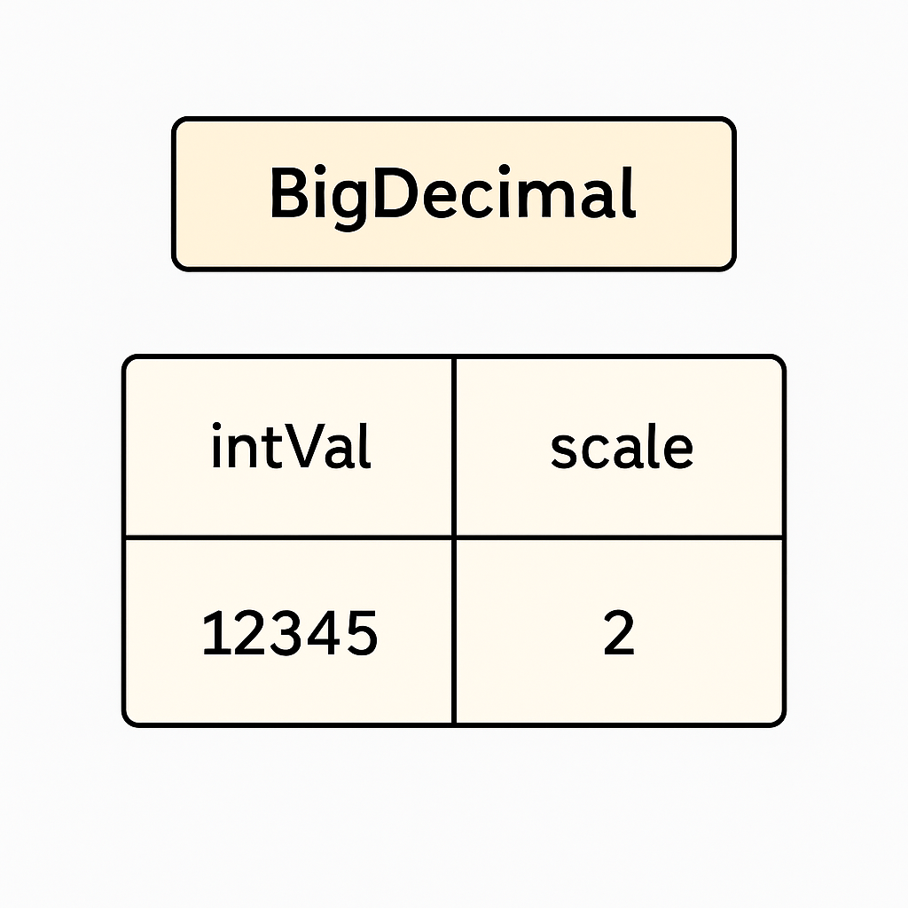

## ✅ Что использовать вместо `double`?

В Java для **точных** вычислений (особенно с деньгами) используют класс:

### `BigDecimal`

```java
import java.math.BigDecimal;

BigDecimal a = new BigDecimal("0.1");
BigDecimal b = new BigDecimal("0.2");
BigDecimal c = a.add(b);
System.out.println(c); // Вывод: 0.3
```

### Преимущества:

* **Точное** представление десятичных чисел
* Нет ошибок округления
* Подходит для работы с валютами, процентами и т.д.

---

## 📝 Резюме

| Тип          | Подходит для денег? | Точность | Пример ошибки                   |
| ------------ | ------------------- | -------- | ------------------------------- |
| `double`     | ❌ Нет              | Нет      | 0.1 + 0.2 = 0.30000000000000004 |
| `BigDecimal` | ✅ Да               | Да       | 0.1 + 0.2 = 0.3                 |

---

## 🔒 Совет новичкам

> Никогда не используйте `float` или `double` для **финансовых** расчётов.
Используйте `BigDecimal` — и ваши деньги будут в безопасности. 💸

---

Отличный вопрос! Давайте разберёмся, **как `BigDecimal` внутри хранит значения** — с технической, но доступной точки зрения.

---

# 🧱 Как устроен `BigDecimal` в Java

Класс `BigDecimal` из пакета `java.math` — это **точный способ хранения и обработки десятичных чисел**. В отличие от `double`, он **не использует двоичную систему с плавающей точкой**, а хранит значения **в десятичной системе**, как человек записал бы на бумаге.

---

## 📦 Внутреннее устройство `BigDecimal`

Внутри `BigDecimal` содержит два основных поля:

```java
private BigInteger intVal;  // Значащие цифры (мантисса)
private int scale;          // Масштаб (кол-во цифр после запятой)
```

> То есть:
>
> $$
> \text{BigDecimal} = \text{intVal} \times 10^{-\text{scale}}
> $$

---

## 🔍 Пример

```java
BigDecimal x = new BigDecimal("123.45");
```

| Компонент | Значение                      |
| --------- | ----------------------------- |
| `intVal`  | `12345` (целое число)         |
| `scale`   | `2` (две цифры после запятой) |



То есть:

$$
12345 \times 10^{-2} = 123.45
$$

---

## ⛓ Как хранятся большие числа?

`intVal` — это объект `BigInteger`, который внутри 
содержит **массив `int[]`**, где каждое число — 32 бита. 
Это позволяет `BigDecimal` оперировать с 
**очень большими или очень малыми** числами без потери точности.

---

## ⚖️ Почему `BigDecimal` точный?

Потому что он:

* Хранит **каждую цифру десятичного числа явно**
* Не зависит от округлений, присущих `double`
* Не имеет ограничений на точность, кроме оперативной памяти

---

## 📐 Примеры вычислений

```java
BigDecimal a = new BigDecimal("0.1");
BigDecimal b = new BigDecimal("0.2");
BigDecimal c = a.add(b);
System.out.println(c); // 0.3
```

Аналогичное на `double` даст:

```java
System.out.println(0.1 + 0.2); // 0.30000000000000004
```

---

## ❗ Что важно помнить

* **Никогда не создавайте `BigDecimal` из `double` напрямую:**

```java
new BigDecimal(0.1); // ❌ НЕ ДЕЛАЙТЕ ТАК
```

Это сохранит **неточное значение** `0.1`, уже испорченное double.

* Делайте так:

```java
new BigDecimal("0.1"); // ✅ правильно
```

---

## ✅ Вывод

| Характеристика                | BigDecimal                                     |
| ----------------------------- | ---------------------------------------------- |
| Представление                 | `BigInteger` (значащие цифры) + `scale`        |
| Основание                     | 10 (десятичное)                                |
| Точность                      | Почти неограниченная                           |
| Типичный случай использования | Деньги, проценты, отчётность                   |
| Недостаток                    | Медленнее, чем `double`, требует больше памяти |

---

#### Поддержка, вопросы и обратная связь по проекту
* [Телеграмм группа проекта](https://t.me/+mvRhG9YECTlkZjQ0)
* [Телеграмм автора курса] (@javagurulv)
* [Емейл автора курса] (itguruby@mail.ru)
